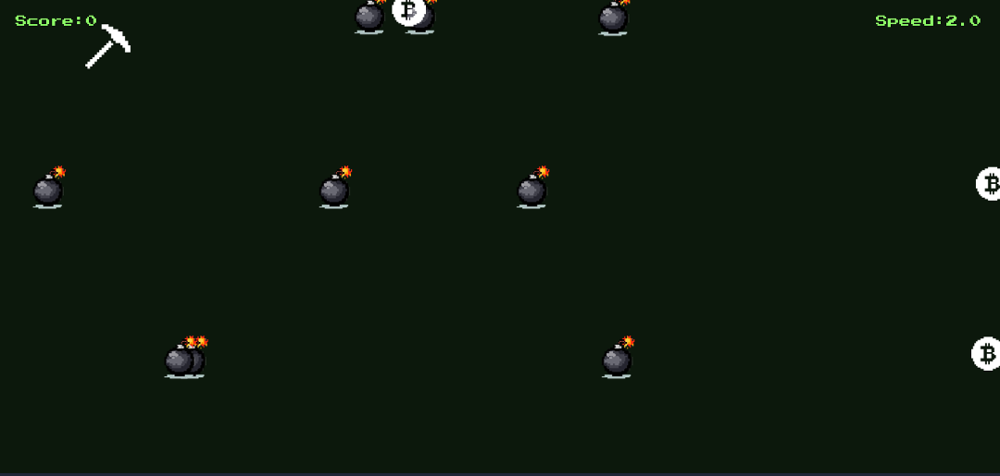

# ⛏️ Dig Big (v1.0)


**Developer:** Umair ([github.com/unseenumair](https://github.com/unseenumair))

---

### 🎮 Characters & Objects
* **Player:** Pickaxe (`playerSprite`)
* **Collectible:** Bitcoin (`addSprite`)
* **Hazard:** Bomb (`bombSprite`)

---

### 🕹️ How to Play
1. Click the screen to start the background music.
2. Use keyboard arrow keys (`⬅️`, `➡️`, `⬆️`, `⬇️`) to move.
3. Collect Bitcoins to score points. The game speeds up every 5 points.
4. Avoid falling bombs. Touching a bomb triggers Game Over.

---

### 🛠️ Tech Stack
* **Language:** JavaScript (ES6+)
* **Engine:** KaboomJS

---

### 📂 Folder Structure
```text
├── www/
│   ├── index.html
│   ├── assets/
│   │   └── banner.png
│   ├── fonts/
│   │   └── pressStart2p.ttf
│   ├── sprites/
│   │   ├── pickaxe.svg
│   │   ├── bomb.png
│   │   └── bitcoin.svg
│   └── sounds/
│       ├── surfers.mp3
│       ├── coin.mp3
│       └── explode.mp3
├── src/
│   └── main.js
├── .gitignore
├── package.json
├── package-lock.json
└── README.md
```

---

### 📝 License
[CC BY-NC 4.0](LICENSE) (Attribution-NonCommercial) - Commercial use and selling of this game is strictly prohibited.
